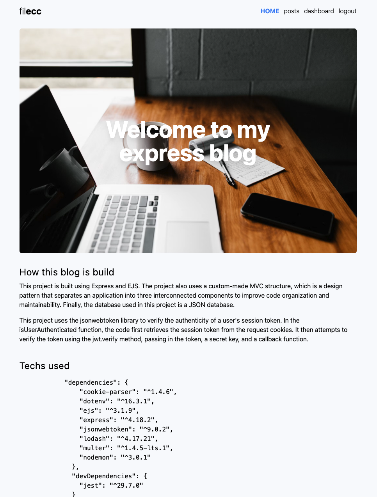

# Express Blog

A personal blog build on NodeJS & Express JS (with EJS as template engine).

## Table of Contents

- [Installation](#installation)
- [Screenshots](#screenshots)
- [Contributing](#contributing)


## Installation

Clone this repo and fill out missing variables in file `.env`.
Rename file `.env.example` as `.env`.

Open a terminale and run

```npm install ```

then run 

```npm start```


## Screenshots

Here are some screenshots of the project:




## Contributing

Fill free to comment out this project.


